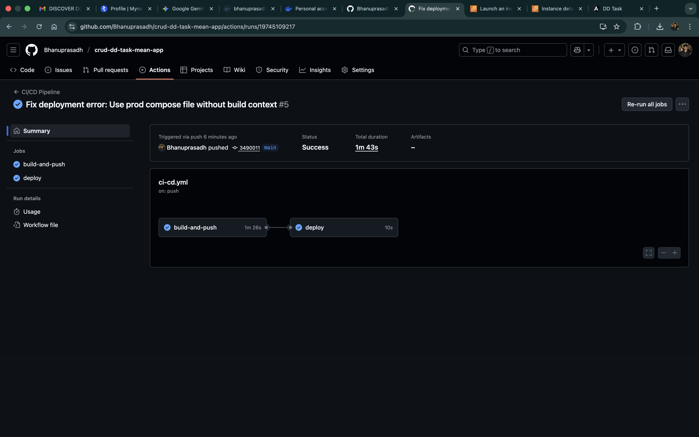
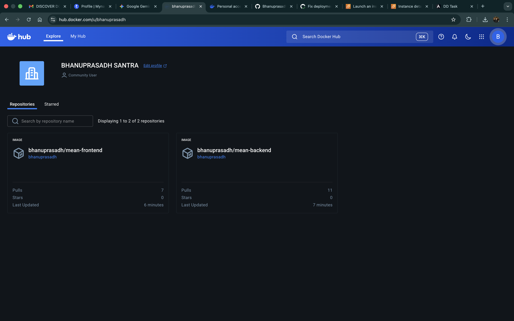
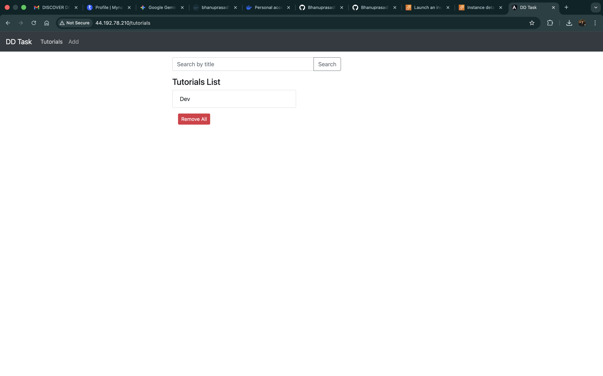
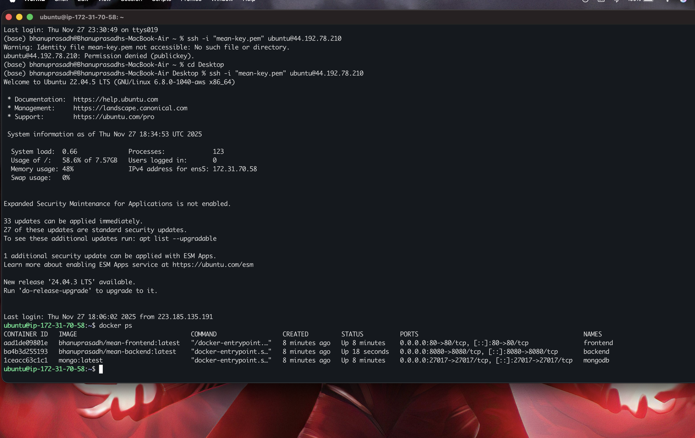

# MEAN Stack CRUD Application Deployment


This repository contains the source code and deployment configuration for a MEAN (MongoDB, Express, Angular, Node.js) stack application. The application is containerized using Docker and deployed via a CI/CD pipeline using GitHub Actions.

## 📂 Project Structure

- `frontend/`: Angular 15 application.
- `backend/`: Node.js/Express application.
- `docker-compose.yml`: Orchestration for local and production deployment.
- `.github/workflows/ci-cd.yml`: GitHub Actions pipeline for automated deployment.
- `AWS_DEPLOYMENT.md`: Specific guide for deploying to AWS EC2.

## 🚀 Deployment Overview

The application is deployed on an Ubuntu Virtual Machine (AWS EC2) using Docker Compose. A GitHub Actions pipeline handles the continuous integration and deployment.

### Architecture
- **Frontend**: Angular app served via Nginx (Port 80).
- **Backend**: Node.js/Express API (Port 8080).
- **Database**: MongoDB (Port 27017).
- **Reverse Proxy**: Nginx routes `/api` requests to the backend.

## 🛠 Setup & Installation

### Prerequisites
- Docker & Docker Compose
- GitHub Account
- Docker Hub Account
- Cloud VM (AWS EC2 recommended)

### Local Development
To run the application locally:
```bash
docker-compose up --build
```
Access the app at `http://localhost`.

## ☁️ Production Deployment

For detailed steps on setting up the AWS infrastructure, please refer to [AWS_DEPLOYMENT.md](./AWS_DEPLOYMENT.md).

### Quick Summary
1.  **VM Setup**: Provision an Ubuntu VM and install Docker.
2.  **Secrets**: Configure `DOCKER_USERNAME`, `DOCKER_PASSWORD`, `HOST_IP`, `SSH_USER`, and `SSH_KEY` in GitHub Secrets.
3.  **Deploy**: Push to the `main` branch to trigger the pipeline.

## 📸 Deliverables & Screenshots

### 1. CI/CD Configuration & Execution
*Screenshot of the GitHub Actions workflow run showing success.*


### 2. Docker Image Build & Push
*Screenshot of Docker Hub showing the pushed repositories (`mean-backend`, `mean-frontend`).*


### 3. Application Deployment & UI
*Screenshot of the running application accessed via the VM's public IP.*


### 4. Infrastructure
*Screenshot of the AWS EC2 instance or terminal showing running containers (`docker ps`).*


## 📝 API Endpoints

- `GET /api/tutorials`: Retrieve all tutorials.
- `GET /api/tutorials/:id`: Retrieve a tutorial by ID.
- `POST /api/tutorials`: Create a new tutorial.
- `PUT /api/tutorials/:id`: Update a tutorial.
- `DELETE /api/tutorials/:id`: Delete a tutorial.

## 📜 License
ISC
